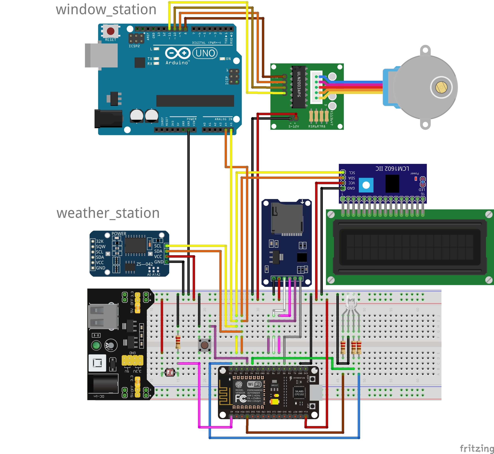
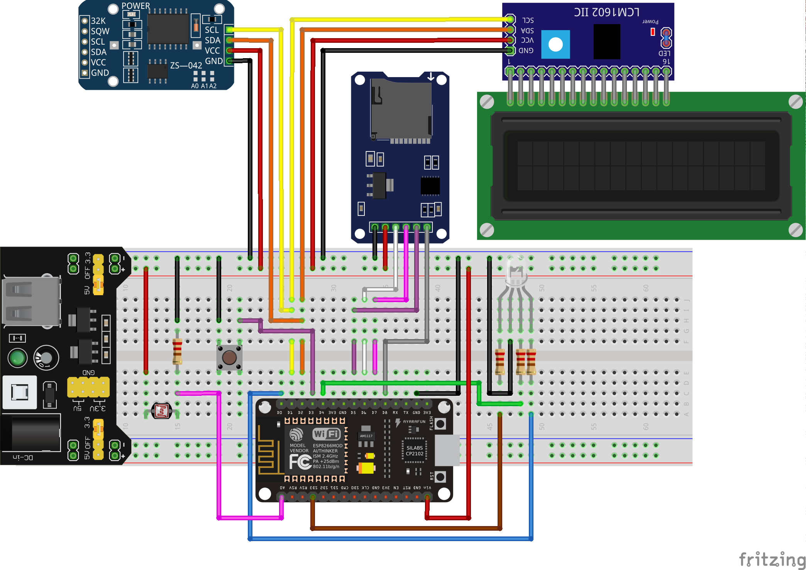
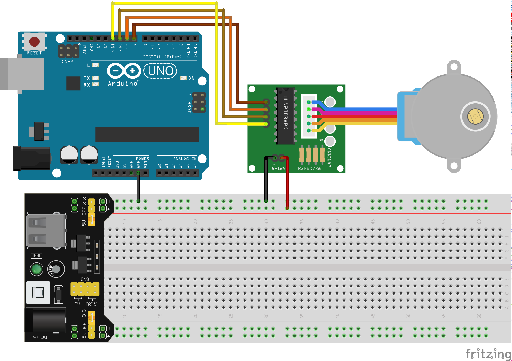

# Telesyk System.
### Smart house system. Hardware part.

### Assembled TS. It combining Weather and Window systems. 

## Weather station

### Requirements
>* NodeMCU ESP8266      - main dev shield
>* DS3231 RTC           - RTC module (Keyestudio prod., 4-pins)
>* LCD1602              - LCD screen
>* I2C LCD module       - I2C interfase for LCD1602
>* Micro SD SPI module  - storage running system information (PG65D)
>* Breadboard           - dev board
>* YwRobot MB-102       - power supply
>* 5v-12v power supply  - power supply for YwRobot
>* Button               - button for switching between modes
>* RGB LED              - RGB LED for color indication
>* Photocell            - photoresistor for measuring light intensity
>* 1x220R               - pulldown resistor for photocell
>* 1x200R               - current limiting resistors for RGB LED (red anode)
>* 2x100R               - current limiting resistors for RGB LED (green and blue anodes)
>* Wires                - connection between modules and power supply

## Window station

### Requirements
>* Arduino Uno			- main dev shield. Uno, or any other Arduino-based
>* Breadboard           - dev board
>* YwRobot MB-102       - power supply
>* 5v-12v power supply  - power supply for YwRobot
>* X113647Stepper		- ULN2003A stepper driver (or any other stepped driver, like L293)
>* 28-BYJ48				- stepped motor (in case using L293 red wire shouldn't be connected)
>* Wires                - connection between modules and power supply