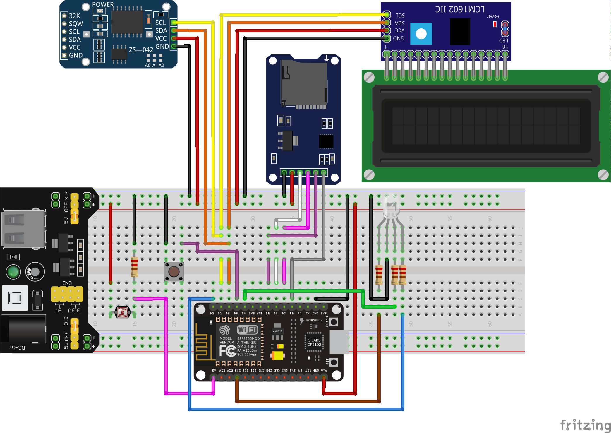

# Telesyk-System-Arduino
### Requirements
>* NodeMCU ESP8266      - main dev shield
>* DS3231 RTC           - RTC module (Keyestudio prod., 4-pins)
>* LCD1602              - LCD screen
>* I2C LCD module       - I2C interfase for LCD1602
>* Micro SD SPI module  - storage running system information (PG65D)
>* 5v-12v power supply  - power supply for YwRobot
>* YwRobot MB-102       - power supply
>* Breadboard           - dev board
>* Button               - button for switching between modes
>* RGB LED              - RGB LED for color indication
>* Photocell            - photoresistor for measuring light intensity
>* 4x220R               - current limiting resistors for RGB LED and pulldown resistor for photocell
>* Wires                - connection between modules and power supply

